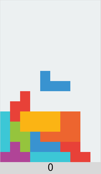
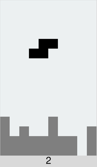

# Tetris for Python / Tkinter



## Controls

* `w` / `up` = rotate left
* `a` / `left` = move left
* `s` / `down` = move down
* `d` / `right` = move right
* `c` = toggle color mode / monochromo mode
* `space` / `escape` = pause / resume / new game

The scoring is a simple as it can be. You get one point for every line cleared.


## Motivation

My motivation for is experimenting with ways of implementing Tetris in Python and having my own Tetris that's exactly the way I like it.

I've written quite a few versions of this game over the years and I've come up with some interesting ideas techniques that I'd like to share below, as I have never seen any of these in any other versions of Tetris I have come across.


## Monochrome mode



Monochrome mode (toggled with the `c` key) shows the falling piece as black
and frozen blocks as gray. This makes it easier to see the total shape
of the block landscape.


## Shapes

I found a very compact way to represent the piece shapes:

```python
shapes = {
    'O': ['56a9', '6a95', 'a956', '956a'],
    'I': ['4567', '26ae', 'ba98', 'd951'],
    'J': ['0456', '2159', 'a654', '8951'],
    'L': ['2654', 'a951', '8456', '0159'],
    'T': ['1456', '6159', '9654', '4951'],
    'Z': ['0156', '2659', 'a954', '8451'],
    'S': ['1254', 'a651', '8956', '0459'],
}
```

Each hex character corresponds to a square in this 4x4 box:

```
0 1 2 3
4 5 6 7
8 9 a b
c d e f
```

For example the first rotation of `T` is `'1456'` which draws this shape:

```
- 1 - -
4 5 6 -
- - - -
- - - -
```

while the second rotation `'6159'` draws this shape:

```
- 1 - -
- 5 6 -
- 9 - -
- - - -
```

You can get coordinates with something like:

```python
>>> [divmod(int(char, 16), 4) for char in '1456']
[(0, 1), (1, 0), (1, 1), (1, 2)]
```

Not that these are returned in `(y, x)` order due to the use of `divmod()`. You may want to flip them around to `(x, y)` before using them.


## Piece

The falling piece is represented as a dataclass:

```python
@dataclass(frozen=True)
class Piece:
    shape: str
    rot: int = 0
    x: int = 0
    y: int = 0
```

```python
>>> from tetris import *
>>> piece = Piece('T')
>>> piece
Piece(shape='T', rot=0, x=0, y=0)
```

To move or rotate the piece I use `dataclasses.replace()`:

```python
>>> replace(piece, x=piece.x + 1)
Piece(shape='T', rot=0, x=1, y=0)
>>> replace(piece, rot=(piece.rot + 1) % 4)
Piece(shape='T', rot=1, x=0, y=0)
```

This returns a copy of the piece that I can test against the board to see if it fits before I actually move it.


## Random Shape Bag

If you choose a random shape every time there will sometimes be very long stretches between each `I` piece. A common solution is to put all shapes in a bag and draw random shapes out of the bag until it's empty, and then put all the shapes back and repeat.

I've implemented this as a generator:

```python
>>> random_shapes = random_shape_bag()
>>> next(random_shapes)
'L'
>>> next(random_shapes)
'S'
>>> next(random_shapes)
'Z'
```


## Field

The field is a list of lists of shapes, with empty squares as `''`. Here's a smaller 8x8 version:

```python
field = [
    ['J', '',  'T', 'T', 'T', 'L', 'L', 'L']
    ['O', 'O', '',  'T', '',  'L', 'O', 'O']
    ['O', 'O', 'I', 'I', 'I', 'I', 'O', 'O']  # Full row
    ['',  '',  '',  'O', 'O', '',  '',  '' ]
    ['',  '',  '',  'O', 'O', '',  '',  '' ]
    ['',  '',  '',  '',  '',  '',  '',  '' ]
    ['',  '',  '',  '',  '',  '',  '',  '' ]
    ['',  '',  '',  '',  '',  '',  '',  '' ]
]
```

Note that we can still see which shape has made up each block. Since each shape has a distinct color this makes it easy to support colors in the GUI.

Note that the field looks upside down here. Row 0 is at the bottom of the screen. This makes it easy to remove full rows:

```python
new_field = [row for row in field if not all(row)]
```

This will return a new field with all full lines removed.

```python
new_field = [
    ['J', '',  'T', 'T', 'T', 'L', 'L', 'L']
    ['O', 'O', '',  'T', '',  'L', 'O', 'O']
    ['',  '',  '',  'O', 'O', '',  '',  '' ]
    ['',  '',  '',  'O', 'O', '',  '',  '' ]
    ['',  '',  '',  '',  '',  '',  '',  '' ]
    ['',  '',  '',  '',  '',  '',  '',  '' ]
    ['',  '',  '',  '',  '',  '',  '',  '' ]

]
```

The rows above (below in this picture) will automatically collapse. You need to add empty rows to fill up the field with something like:

```python
cleared_rows = len(field - new_field)
new_field = [['' * 8] for _ in range(cleared_rows)
field = new_field
```

## Future Plans

I will tinker with the code from time to time but I have no plans for additional features.


## Contact


Ole Martin Bjørndalen
https://github.com/olemb/tetris/
